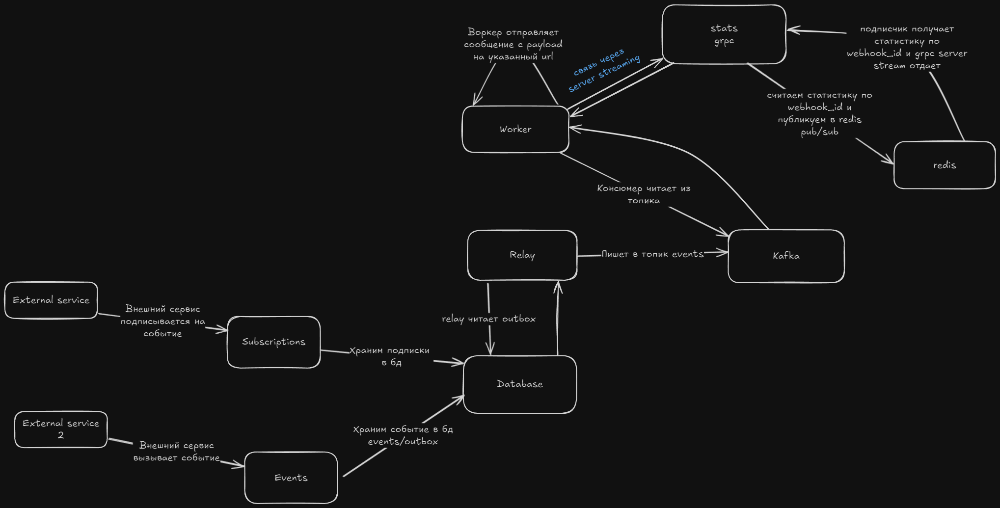

# webhook relay

## Как это работает

## Использованные технологии
go, grpc, kafka, zap, redis pub/sub, pgxpool/pgx, docker, viper, validator,

## Сервисы
- stats - сервис статистики(grpc)
- api - api для subscription и events
- relay - producer кафки
- worker - consumer кафки + клиент stats server stream grpc

## Основные сущности

### Subscriptions
| name | type| requires| default |
|--|--|-|-|
|id        |uuid|t|-|
|url       |text|t|-|
|secret    |text|t|-|
|active    |bool|t|t|
|created_at| timestamp | t | current time |

### SubscriptionEvents
| name | type| requires| default |
|--|--|-|-|
|id              |bigserial    |t|-|
|subscription_id |uuid         |t|-|
|event_type      |varchar      |t|-|

### Events

| name | type| requires| default |
|--|--|-|-|
|id          |uuid      |t|-|
|event_id    |text      |t|-|
|event_type  |varchar   |t|-|
|payload     |jsonb     |t|-|
|create_at   |timestamp |t|current time|

### Delivery
| name | type| requires| default |
|--|--|-|-|
|id              |bigserial |t|-|
|event_id        |uuid      |t|-|
|subscription_id |uuid      |t|-|
|status          |varchar   |t|-|
|attempts        |int       |t|-|
|last_attempt_at |timestamp |t|-|

### outbox
| name | type| requires| default |
|--|--|-|-|
|id              |bigserial    |t|-|
|event_id        |text    |t|-|
|status          |varchar(30)    |t|-|
|created_at      |timestamp    |t|-|